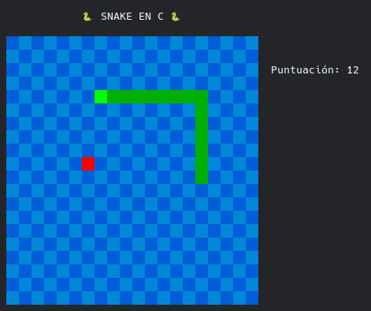

# 🐍 CSnake

[](https://wakatime.com/badge/user/72f82c75-11de-43fd-979a-a5efbf06f882/project/b6b1c648-919c-4e4d-93e2-6df57ab6c647)

**CSnake** es una implementación en **C** del clásico **Snake**, jugable desde la terminal en Linux.  

---

## 🎮 Para jugar

1. 🔽 **Clona el repositorio**
   ```bash
   git clone https://github.com/PrudenK/CSnake.git
   ```

2. 🛠️ **Abre tu archivo `.bashrc`**
   ```bash
   nano ~/.bashrc
   ```

3. 🐍 **Añade este alias** (ajusta la ruta a tu proyecto):
   ```bash
   alias csnake='cmake -S ~/CLionProjects/CSnake -B ~/CLionProjects/CSnake/build && cmake --build ~/CLionProjects/CSnake/build && ~/CLionProjects/CSnake/build/CSnake'
   ```

4. 🔄 **Aplica los cambios**
   ```bash
   source ~/.bashrc
   ```

5. 🚀 **Ejecuta `csnake` en tu terminal y juega**

---

## 🖥️ Cómo se ve en el terminal

<div align="center">
  
</div>

---